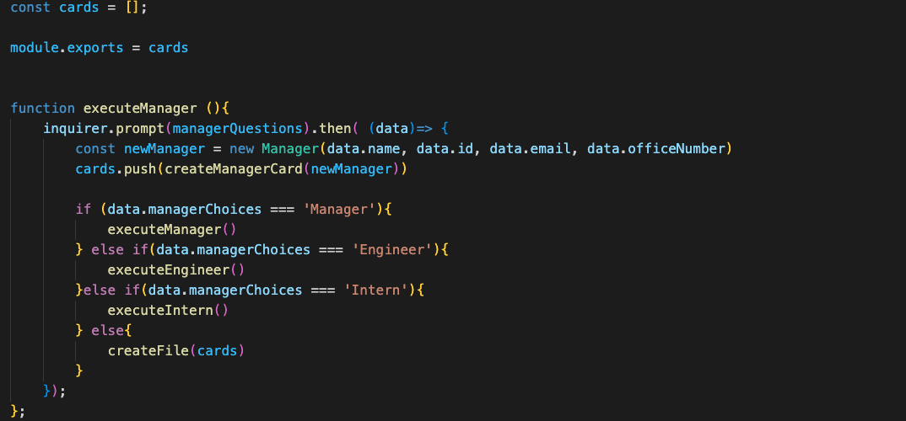

## Table of Contents
  * [License](#License)
  * [Title](#Title)
  * [Description](#Description)
  * [Installation](#Installation)
  * [Usage](#Usage)
  * [Contribution](#Contribution)
  * [Test](#Test)
  * [Technologies](#Technologies)
  * [Questions](#Questions)
  * [Spot-light](#Spot-light)
  
  ## License
  
  

  # Team Roster Genenerator
  ### by Grant Ellington
  
  ## Description
  This program creates an HTML page which will show you your team roster. The roster includes items like all emails for employees, office Numbers, Github accounts, and of course positions. 
  
  ## Installation
  To install, clone the repository and run node index.js to run the program, you can then run a live server the html under dist to see the generated html page. See the Spotlight section to see it in action.
  
  ## Usage Information
  For usage policies, see the MIT licsence or constact the creator dowen in questions.
  
  ## Contribution 
  The program was created by the creatator listed above und er the title, to contribute contact the createator under the questions section.
  
  ## Test
  
  Test was completed via jest.
  
  
  ## Technologies
  Project is created with:
  * JavaScript
  * Inquirer
  * Jest
  ## Set-up
  To set-up see Installation. 
  
  ## Questions
  The was created by Grant Ellington. you can message me at the link below.
  [GrantEllingotn](gellingtonem6@gmail.com)

  ## Spot-light

  Below are the questions that are passed through the inquirer.prompt

  
  
  The below is an example of how I created the classes, similiar I extended the classes for Engineer, Manager, aand the Intern role.
 
  

  Each role had its own template literal which is pushed to into the cards array.

  

  This was built in an OOP style, and therefore uses several files, below show some that are exported and imported into the main index.js file.

  

  This is an example of the main program. It ends with an if statement for the last question whcih will create other cards, or finish and create the html page.
  

  I also created test of the classes created testing there out put.
  
  

Here is an example of the program running
https://user-images.githubusercontent.com/109107643/197419208-3e6227a0-dabf-45e2-9bc7-c203815f0456.mov

